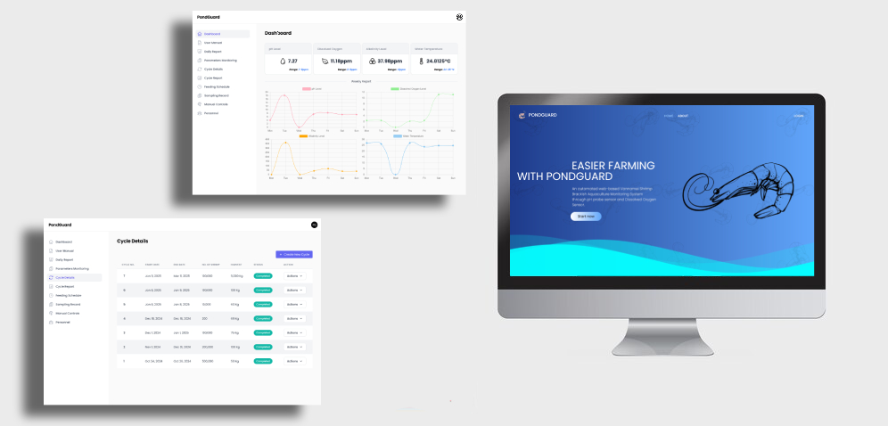
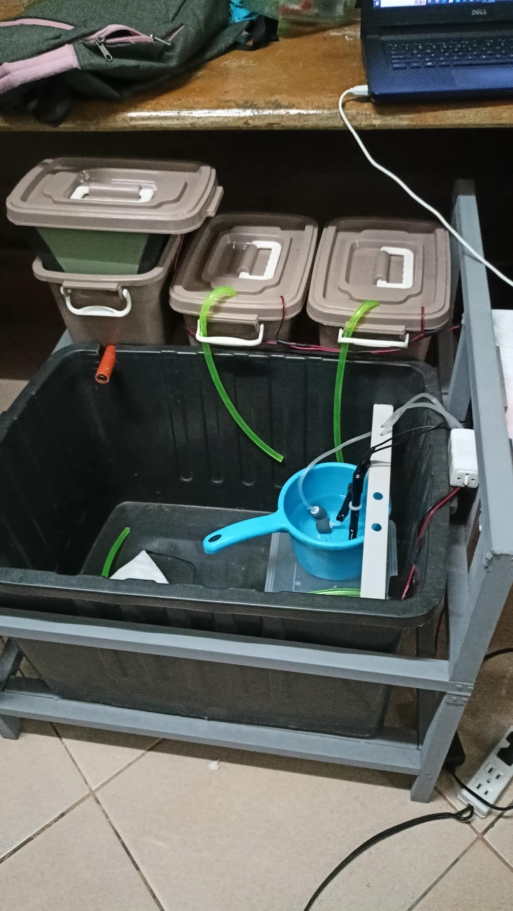

# PondGuard - IoT Solution for Shrimp Farming

**PondGuard** is an **IoT-based website** developed for real-time monitoring and management of shrimp farming operations. Built with **Laravel (TALL Stack)** and **Firebase**, it allows farm owners to track key water parameters like water temperature, dissolved oxygen, alkalinity, and pH levels. The system automatically adjusts and balances these parameters for optimal shrimp growth, tracks cycles and harvests, and provides manual control when needed.

Visit the live app: [PondGuard](https://yellow-grouse-983712.hostingersite.com/)

Deployed on **Hostinger**.

## Features

- **Real-time Monitoring**: 
  - Monitors **water temperature**, **dissolved oxygen (DO)**, **alkalinity**, and **pH levels** of the shrimp pond in real-time using **Firebase**.
  - Displays live graphs for water temperature, dissolved oxygen, alkalinity, and pH levels.
  
- **Automated Parameter Control**:
  - Automatically adjusts water parameters such as temperature, dissolved oxygen, alkalinity, and pH level to ensure optimal shrimp farming conditions.
  
- **Sensor Integration**: 
  - **ESP8266** microcontroller communicates with sensors.
  - **Gravity: Analog Dissolved Oxygen (DO) Sensor Meter Kit** for DO monitoring.
  - **Gravity Analog pH Sensor** for measuring pH levels.
  - **DS18B20 Temperature Sensor** for water temperature monitoring.
  - Alkalinity is calculated based on pH level readings and threshold values.

- **Cycle and Harvest Management**: 
  - Users can create farming **cycles** and **harvests** in kilograms.
  - All cycle and harvest data is logged and stored in the **Firebase** database for analysis and tracking.
  
- **Feeding Schedule and Automation**: 
  - **Automatic feeding** based on schedules, ensuring that shrimp are fed regularly.
  - The system can trigger feeding events based on real-time water parameter data.

- **Manual Control**:
  - Users can manually adjust water parameters or control feeding through the website interface.
  
- **Data Logging & Firebase Functions**:
  - The system logs water parameters to **Firebase** for future analysis.
  - Firebase functions automatically calculate and store data for the graphs to monitor water parameters over time.

## Installation

### Prerequisites

Make sure the following tools are installed:

- **PHP** (version 7.4 or higher)
- **Composer** (for managing PHP dependencies)
- **Node.js** (for compiling front-end assets)
- **Laravel** (latest stable version)
- **Firebase Account** (for real-time data handling)
- **ESP8266** Microcontroller and sensors

### Steps

1. Clone the repository:

    ```bash
    git clone https://github.com/DevMike13/PondGuard.git
    cd PondGuard
    ```

2. Install PHP dependencies:

    ```bash
    composer install
    ```

3. Set up your environment file:

    Copy the `.env.example` to `.env`:

    ```bash
    cp .env.example .env
    ```

4. Set up your Firebase credentials:
    - Create a Firebase project and get your Firebase credentials.
    - Add your Firebase credentials to the `.env` file.

    ```bash
    API_KEY_FRB=your-firebase-api-key
    AUTH_DOMAIN=your-firebase-auth-domain
    DATABASE_URL_FRB=your-firebase-database-url
    PROJECT_ID_FRB=your-firebase-project-id
    STORAGE_BUCKET_FRB=your-firebase-storage-bucket
    MESSAGING_SENDER_ID_FRB=your-firebase-messaging-sender-id
    APP_ID_FRB=your-firebase-app-id
    ```

5. Set up your database:
    - Create a database in MySQL and configure your database settings in the `.env` file:

    ```bash
    DB_CONNECTION=mysql
    DB_HOST=127.0.0.1
    DB_PORT=3306
    DB_DATABASE=pondguard
    DB_USERNAME=root
    DB_PASSWORD=
    ```

6. Generate your application key:

    ```bash
    php artisan key:generate
    ```

7. Run the migrations to set up the database:

    ```bash
    php artisan migrate
    ```

8. Install front-end dependencies:

    ```bash
    npm install
    ```

9. Compile the front-end assets:

    ```bash
    npm run dev
    ```

10. Start the development server:

    ```bash
    php artisan serve
    ```

11. Visit the app in your browser at `http://localhost:8000`.

## Hardware Setup

1. **ESP8266**: 
   - The **ESP8266** is used as the communication hub between your sensors and the server.
   - It collects data from sensors and sends it to the backend via the internet.

2. **Sensors**:
   - **Gravity: Analog Dissolved Oxygen Sensor**: Monitors the dissolved oxygen level in the water.
   - **Gravity Analog pH Sensor**: Monitors the pH levels in the water.
   - **DS18B20 Temperature Sensor**: Monitors the water temperature.

3. **Alkalinity Calculation**:
   - Alkalinity is derived from pH level readings using a specific threshold and formula.

4. **Feeding Mechanism**: 
   - Automatic feeding systems are controlled by the website based on schedules and parameters.
   - Can also be manually controlled through the web interface.

## Features Breakdown

1. **Real-Time Data**: 
   - Water temperature, dissolved oxygen, alkalinity, and pH levels are monitored in real-time.
   - Data is automatically updated and visualized in **Firebase** and shown on the website.

2. **Graphs & Data Storage**:
   - All water parameters are logged to **Firebase** for tracking over time.
   - Data is visualized in graph form on the website to help users analyze trends and make informed decisions.

3. **Cycle & Harvest Management**:
   - Users can track cycles and manage shrimp harvests, specifying the harvest amount in kilograms.
   - This helps to ensure proper growth and production tracking.

4. **Feeding Automation**:
   - The system allows automated feeding based on water parameter thresholds and schedules.

5. **Manual Control**:
   - Users can manually adjust parameters such as temperature, oxygen, pH, and alkalinity through the website.

## Technologies Used

- **Laravel (TALL Stack)**: 
  - **Tailwind CSS**: For responsive and modern UI design.
  - **Alpine.js**: For dynamic user interactions.
  - **Livewire**: For building dynamic interfaces without writing much JavaScript.
  
- **Firebase**: 
  - For real-time data monitoring and logging.
  - **Firebase Functions** for calculations and automations.

- **ESP8266**: For communication between sensors and the web application.

- **Sensors**:
  - **Gravity: Analog Dissolved Oxygen (DO) Sensor** for measuring DO levels.
  - **Gravity Analog pH Sensor** for measuring pH levels.
  - **DS18B20 Temperature Sensor** for monitoring water temperature.

- **MySQL**: For storing data such as cycle and harvest information.

- **PHP**: Backend logic and API integrations.

## Screenshots

Here’s how the **PondGuard** app looks:

  

## Prototype

Here’s some images of the **PondGuard** machine prototype:

  


## License

This project is private and is not open for public use or distribution.
